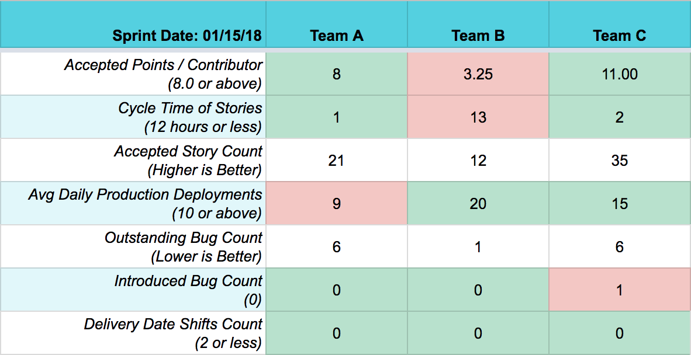

# 高效 Tech Lead 的敏捷项目

原文链接：[Agile Practices of Effective Tech Leads](https://medium.com/the-andela-way/agile-practices-of-effective-tech-leads-888c46eb1710)

Tech Lead（技术负责人）或技术团队负责人或工程负责人是软件开发学科中的共同角色。该人员负责复杂软件解决方案的整体规划、执行和成功，以满足客户的需求。在过去一年半的时间里，我花了很多时间在 Andela 的工程部门指导 Tech Lead。在这篇文章中，我将分享我迄今为止所学到的，关于我认为为敏捷团队中的高效的 Tech Lead（技术负责人）所做的关键实践。

## 1.协作

身为一个 Tech Lead，您花费了大量时间来识别和清除团队的障碍。它需要有效的协作技能。您需要与不同的业务功能协作，以获取团队需要前进的方向。通过与产品经理合作，确保下一个开发迭代里 backlog 有足够的卡，从设计人员获取特定功能的高保真设计，以确保团队中的开发人员拥有合适的硬件来完成工作。一个伟大的 Tech Lead 要提前考虑、预测风险，并在他们成为团队的瓶颈之前解决它们。

高效的 Tech Lead 也是一个很好的沟通者。他们为非技术人员找到理解技术概念的方法。他们通过将业务术语引入开发团队并鼓励他们使用，以促进对业务利益相关者的理解和同情，从而最大限度地减少翻译层。

## 2.团队调试

随着开发人员在职业生涯中，从单个贡献者发展为领导一个团队，他们通常会从调试他们正在构建的软件，转向调试，他们领导的团队。各种阻止程序可能阻碍开发团队满足其可交付成果（例如，糟糕的任务管理、不明确的需求、复杂的开发过程等）。为了指导团队调试工作，Andela 工程部门的 Tech Lead 使用我们所谓的 “Team Vitals” 来监控团队的健康状况。

与医生如何监测一个人的白细胞计数以确定是否存在感染相似，我们已经制定了每周监测团队健康状况的指标：

 - 任务的周期时间
 - 每个贡献者接受的点数
 - 已接受的故事卡数量
 - 突出的 bug 数量
 - 引入的错误数量
 - 交付日期发生变化
 - 平均每日生产部署次数

我们为每个指标设定目标，并在团队回顾期间每周检查一次，以找出指标特定转变（正面或负面）的根本原因。

我们使用 PivotalTracker，这是一个功能强大的任务管理工具，提供深入的分析，可以轻松自动捕获大多数生命体征的测量值。生命体征不是一成不变的，而是按季度进行审查并相应调整。

## 3. 技术债务管理

技术债务是每个开发团队（无论大小）必须处理的事情。在构建软件时，技术债务会以各种方式累积下来。有时候它会通过明确的妥协来实现：你故意选择以不可持续的方式做某事，以便更快地将产品推向市场，并告诉自己以后要清理一下。其他时候，技术债务会产生，因为建筑技术很难，人们会犯错误，你无法预测未来，这意味着有时你会制造错误的东西。

一个伟大的 Tech Lead 以有效的方式管理技术债务，以确保它不会累积到那种程度——团队正在做的唯一事情是偿还债务，而不是迭代产品。在处理技术债务时没有银弹，但这里有两种我认为合作良好的做法：

> 度量技术债务

如果你不度量它，你不知道它有多大以及它的增长速度。任何时候你遇到技术债务走过代码库，创建一个任务并将其标记为 “技术债务”。

> 持续偿还技术债务

我们有一个 80/20 规则。便是在给定的迭代中，花费 80％ 的时间迭代产品，20％ 的时间来修复债务。Tech lead 们需要确保在每次迭代中，优先考虑一些与债务相关的任务。

## 4. 任务管理

也许一个优秀的软件开发团队最关键的要求之一就是**一致的速度**，以及**实现其估算的能力**。若想实现这一壮举，便需要掌握任务管理方法，而不仅仅是将任务分配给团队中的开发人员。以下是 Andela 的 Tech Lead 实践中的一些任务管理行为：

 - 在跟踪器（tracker）中追踪一切（例如 TODO、技术债务、研究琐事、想法），即：#NoTicketNoWork
 - 确保所有的团队成员，都能够将任务添加到 icebox 中。
 - 确保 backlog 总是有足够的工作量，至少可以进行 1 到 2 个迭代
 - 每天更新 backlog。寻找如何将较大的任务分解为较小的任务。查找一个任务依赖于另一个任务的依赖项。
 - 只当任务已经被分解到尽可能低的复杂性，才开始开发（例如，我们团队中的开发人员只处理估计为 1 点的任务，Pivotal Tracker 在其复杂点系统中的最低排名）
 - 根据团队中开发人员感受的复杂程度细分任务，而不是作为技术主管感受的复杂程度。如果团队中缺乏经验丰富的开发人员，那么这一点尤为重要
 - 每当任务感觉 “陈旧” 时检查任务的状态（例如，它已启动超过一天）

实践上述行为，有助于 Tech Lead 在团队速度减慢时发展出第六感，并提高他们迅速采取行动，以使团队重回正轨的能力。

## 5.导师

最后，但同样重要的是，伟大的 Tech Lead 是伟大的导师。他们的目标是培养和指导团队中的开发人员，经常提供他们的工作反馈，并鼓励和促进最佳工程实践。他们通过委派日益复杂的问题来扩大团队的技术能力，并定期与开发人员进行编程以提供技术指导。伟大的 Tech Lead 知道，他们的成功取决于他们团队成员的成功。

Tech Lead 是任何软件开发团队成功的关键角色。他们是开发人员的发声板，工程师对其他业务职能的支持，以及制定或破坏项目的关键技术决策。提供满足用户需求的出色软件解决方案，需要出色的 Tech Lead。我相信掌握上述五种做法，可以产生更多的实践。

